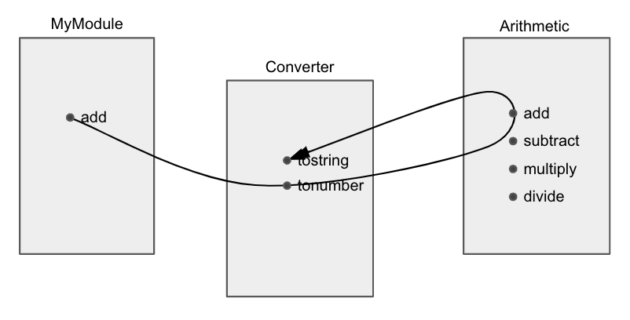

# Elune

Elune is a programming language that I've worked on here and there for several years. It's a labor of love that has built up a nice stack of notebooks. It does not have a compiler. Or rather, it has many compilers, none of them finished, because I kept getting ideas for significant improvements.

Elune began life as syntactic sugar for Lua's functional aspects and started receiving major ground-up redesigns as I continued working on it.

### First-class functional

"Functional language" has tended to refer to ML-style pure statically-typed languages such as Haskell, even though first-class functions are not related to either pure functions or the type system. If you have an expression `f(a)` where `a` can be paramaterized, why can't `f` be parameterized also? The lack of first-class functions is what needs to be justified, not their presence. We should call languages without first-class functions "nonfunctional languages", I think.

Elune is a functional language in the general spirit of dynamically typed scripting languages. The feature that will initially stand out is that functions are specified by parentheses. The following is a function that returns the number 1:
```
(1)
```

A function that adds its two arguments:
```
( a b | a + b )
```

Elune uses functions for almost everything, including control structures. Because of this, parentheses are an aesthetic and practical choice for functions. Having curly braces everywhere would be hideous, for instance.

The parameter-body separator is a vertical bar. This is also an aesthetic choice in terms of how common functions are. I don't like arrow notations such as `( a b -> a + b )` because arrows are too strong, way up in the drama, like hold on its just a function no need to point. The vertical bar is a nice neutral separator that has the right feeling in larger bodies of code. I also don't like the empty parameter forms that arrow notations have since they are visually unbalanced.

A couple of years into the project, I found a sample of Smalltalk code. I'd heard good things about Smalltalk but never used it. It had a notation for functions that used the vertical bar. The look on my face when I realized that the creator of Smalltalk was a time traveler that had stolen my idea, traveled back in time, and cheekily changed my parentheses to square brackets to hide their plagiarism. Lol. I thought it was pretty interesting, because I wonder if the designer of Smalltalk had chosen the vertical bar for similar reasons.

Function application is based on space, similar to Haskell. Add two numbers:
```
> ( a b | a + b ) 1 2
3
```

Variable assignment:
```
5 => x
```

I didn't determine a scheme regarding mutability/immutability, but I would probably go with something like Swift's optional copy-on-write value semantics if I were to write an implementation of the language today. I am also leaning to not having variables be reassignable, but that is a more difficult judgement to make without seeing how the module system works out.

For most of the history of the language, it had a `let`/`variable` syntax for, among other things, distinguishing between initialization and reassignment. But if reassigning doesn't stay, this is no longer necessary. No-reasign also simplifies what would otherwise be difficult design choices in terms of the scoping rules. One thing that has to be considered when judging ideas for the language is that any given line of code can be potentially many function levels deep in the syntax tree.

Two different equivalent ways of defining a function:
```
Define add ( a b | a + b )
( a b | a + b ) => add
```

### Just write it out

One thing I noticed after writing a lot of hypothetical code in my language and then going back to common everyday languages is that most languages are excessively succinct. I distinctly remember feeling flustered by Python's `def` for defining functions. What's wrong with `define`? The succinctness of programming languages is due to two things, I think. One is the remnants of storage space and performance being an issue, and the other is the general mathematical heritage of programming, which I feel is misplaced.


### Precedence

Precedence in Elune is left-to-right. It's a hard rule in order to keep the language straightforward.  The following prints the number 3, and then adds 2 to the result.

```
Display 3 + 2
```

This code will work since Display is semantically equivalent to the Identity function. To print the sum, square brackets can be used around the addition:

```
Display [3 + 2]
```

Since functions are using parentheses, there are a few other choices for grouping: Square brackets, angle brackets, curly brackets. Of these, square brackets make the most sense, in part because grouping tends to be done on the same line, so the aesthetics of square brackets play well. Angle brackets break the flow and curly brackets are too hideous.

Among other things, keeping the precedence rules straightforward is useful for the sake of the left-to-right flow of the language.

### Left-to-right flow

One of the most harmful-considered vestiges of mathematical heritage in my opinion is the verb-subject order that functions are written in, such as `g(f(a))`. This can be argued to make sense in mathematical notation because function names are short, so humans can get used to the notation as clumsy as it is. But in programming languages I feel constantly at odds with it because the way I think is subject-verb. I really want to write something like "start with `a` then do `f` then do `g`".

In Elune, the slash modifier makes this work. Attaching / to the beginning of any element will give it operator semantics that causes it to pull its first argument from the left. The following all print the number 5:

```
Display [add 3 2]
add 3 2 /Display
3 /add 2 /Display
3 /( a b | a + b ) 2 /Display
```

An example of the standard verb-subject approach:
```
x = Take [Sort { 3, 2, 4, 1}] 2
```
Versus the subject-verb approach:
```
{ 3, 2, 4, 1 } /Sort /Take 2 => x
```

The standard `lhs = rhs` syntax was in the language for most of its history, but I believe it's necessary to try the experiment of having only rightward assignment. I think this is the right choice, but probably won't be obvious to a programmer until they use the language for a while. I think we just get used to the `lhs = rhs` form. Right assignment is less stressful in the same way that electric cars are less stressful than gasoline cars. I know I'm making perfect sense.

### Tables

Elune steals Lua tables almost verbatim. Lua's tables are an array-map hybrid data structure, both in implementation and in syntax. I'm not 100% sure that having both arrays and tables use the same curly bracket notation is the best choice, but one of the design choices of the language is a functional polymorphism between functions, arrays, and maps, so using curly brackets for both arrays and maps is a way of staying in line with this polymorphism.

Example tables:

```
{ "age", 255 } => tuple
{ 8, 71, 21, 44 } => array
{ 'name : "Charlie", 'age : 255 } => object
{ 8, 71, 21, 44, 'name : "Sarah", 'age : 255 } => hybrid

{ 'value : 6
  'left  : { 'value : 8, 'right : { 'value : 10 } }
  'right : { 'value : 4 } } => tree
```

The following all return the number 5:
```
{ 'key : 3 } 'key + 2 // table
{3} 1 + 2 // array
( 'key | 3 ) 'key + 2 // function
```

`Map x` is a key query into the map. `Function x` is a function call with x passed in as an argument, `Array x` is an index query into the array. The purpose of this polymorphism is general flexibility and particular design considerations for the module system. I toyed with notations for combining all three into one, and functions on their own are semantically flexible enough to accomodate all of them if given an assignment mechanic, but I felt there was not much to gain from that approach. However, I would consider letting functions handle maps and having arrays be a distinct type using the curly bracket notation. 

One point in favor of giving arrays their own notation is having a clear 1-to-1 mapping with JSON so that `data /To 'JSON /From 'JSON =? data` without requiring any mapping customizations.

Arrays in Elune are 1-indexed. 0-indexing is practical for lower-level languages in terms of memory offsets and so on, but it isn't how people normally think, and in my opinion mathematical arguments in favor of one or the other are misplaced. Another consideration is that the language is built for high-level functional manipulation of arrays, so lower-level manual indexing is less important.

`'` is a short notation for strings. `object'field` is interpreted as `[object 'field]`. Elune uses maps/dictionaries/hash tables as its object system. I'm partial to Lua's metatable system for inheritance, which is similar to Javascript's prototypal OO system, but depending on how the Elune module system turns out this might be unnecessary complexity.
```
> 'Charlie =? "Charlie"
"Charlie"
```

Logical expressions return the right-most element if they are truthy and `Nil` if they are falsy. Elune doesn't have symbols like the Lisp languages and doesn't have macros. Even in lisp languages, I found that first-class functions could accomodate any kind of abstraction I wanted to construct. I believe macros are popular in lisp because the language makes them easy, but also because macros are a performance tool, which would have made a big difference in previous decades. That said, I've never been a big lisp user so I'm not really one to judge.

### Patterns

Functions support multiple parameter specifications. Function parameters can be values and patterns. The following evaluates to the 5th Fibonnacci number:

```
( 1 | 1
  2 | 1
  n | Self [n - 1] + [Self [n - 2]] ) 5
```

`Self` refers to the function itself. Note that `Self [n - 1] + Self [n - 2]` would not work. Because of the left-to-right precedence, that would be the same as `[Self [n - 1]] + Self] [n - 2]`, where you're trying to add a function to a number.

At the time I came up with this pattern matching scheme, I was inspired by my experience with Mathematica. A few years later, I ran into Erlang, which has many suspicious similarities to my approach and broader aspects of the language itself. Once again, a time traveler was up to some shenanigans. In reality, the core mechanisms of pattern matching probably constrain much of the possible designs.

An example of a switch statement:
```
somevalue > (
    0 | Display "It's 0."
    1 | Display "It's 1!" )
```

`a > f` is the same as `f a`. It is a semantic version of the slash modifier. If no clause matches, the function returns `Nil`.

```
sometable > (
    { 1, b } | Display "{ 1, [b] }"
    { a, b } | Display "The first element is not 1."
    else | Display "Not sure what [else] is." )
```

Get the leftmost node value in a tree:
```
Define leftmost (
    { 'left : left }   | Self left
    { 'value : value } | value )
```

There is also a notation for doing the following:

```
([a : =? x] | "You gave me the current value of x.")
```

But it is easy to get carried away adding a lot of ugly syntax that doesn't gain the language much.

Predicates. `[a : f]` as a parameter specification will match if `f a` is non-nil. Add two numbers only if they are both even, return `Nil` otherwise:

```
Define add-evens ( [a : Even?] [b : Even?] | a + b )
```

Fizzbuzz.
```
1 To 100 . (
    [i : /Modulus 15 =? 0] | "fizzbuzz"
    [i : /Modulus 5 =? 0] | "buzz"
    [i : /Modulus 3 =? 0] | "fizz"
    i | i ) . Display
```

### .
`.` is the map/iteration operator. Print all the values in a table:
```
table . ( i | Display i )
```
Same thing:
```
table . Display
```

Print the numbers from 1 to 100:
```
1 To 100 . Display
```

Print a message 100 times:
```
1 To 100 . ( Display "Hi." )
```

"For loop":
```
1 To 100 By 2 . ( i |
    Display "Odd number: [i]"
)
```

The dot operator applies the numbers 1, 2, 3, ... to the map on the left hand side and stops on the first nil it receives.

```
// grab elements 20 to 30 of a table
20 to 30 . table

// reverse the elements in a table
Length table To 1 By -1 . table

// another way of printing a message 100 times
[<=? 100] . ( Display "hi" )
```

### Partial application
Currying and partial application:
```
( a b | a + b ) 1 => add1
( a b | a + b ) 4 => add4

> add1 5
6
> add4 5
9
```

I'm not 100% sure partial application is a good idea. The main intent is to bring to Elune some of the power that the APL family of languages have. For instance, to compare each element of an array against a particular number:

```
array . [< 5]
```

It's tempting to use vectorization/"broadcasting" for comparisons, such as the way numpy would interpret `array < 5`, but I'm not sure this is a good idea in Elune in terms of the straightforwardness of the semantics.

Elune identifiers can be any sequence of symbols not beginning with a number:

```
Define even? ( n | n /Modulus 2 =? 0 )
Define even? ( _ /Modulus 2 =? 0 ) // implicit single parameter
Define even? [/Modulus 2 =? 0] // partially applied at the front
```

They can include emojis and everything else. The reason for this is to make it easier for non-English users to use variables that are normal for them. The only exception would be a wide rule banning all non-printing characters, to whatever degree that's possible in Unicode. Functions can use an underscore as an implicit parameter when they have no explicit parameters specified. Multiple implicit parameters are not supported, since they are hideous.

### Bottom values

I'm not sure I want an explicit `False` in the language. I'm leaning on no, since there is a lot of redundancy with `Nil`. Functions with no parameters can be called with any argument, but the standard would be `f []`, which is semantically equivalent to `f Nil`. The function `Unique` will create values that are not equal to anything else, even though object references could be used for that role. It depends on the precise value/reference semantics that are used. I'm partial to having value semantics throughout the language.

Example operators:

```
{ <?, >?, <=?, >=?, !=?, and, or } . (_ 2 3)
3     // 2 <? 3
Nil   // 2 >? 3
3     // 2 <=? 3
Nil   // 2 >=? 3
3     // 2 !=? 3
3     // 2 and 3
2     // 2 or 3. and/or are short-circuiting
```

Notice that it is (_ 2 3) and not (2 _ 3). This is because the way that the operators are placed in the table causes them to be partially-applied on both the left and the right, so they become regular two-argument prefix functions. An expression such as `Nil =? Nil` will return `"True"`.

### Mutability/immutability

Immutability is not a goal for the language, it may be the default but not required.

Memoized Fibonacci function. `Do f` just executes the function `f`. It doesn't do anything special but is the idiom for limiting scope.
```
Do (
    {} => Mutable memo

    ( [1 | 2] | 1
      [n : memo] | memo n
      [n : Negative?] | "😑"
      n | Self [n - 1] + [Self [n - 2]] => memo n)

) => fibonacci
```

Elune is an expression language. The last expression is the return value, and assignment returns the assigned value. The first clause is an or clause `[1 | 2]` that matches either 1 or 2.

Anything can be a key or a value in a table.
```
{ Display : {"a"}, add : {1, 2} } => fs
fs /KeyValues . ( { k, v } | k /Apply v )
```

### Application polymorphism

More examples on the polymorphism between arrays, functions, and maps:

```
{ "a", "b", "c" } => table

( 1 | "a"
  2 | "b"
  3 | "c" ) => f1

( n | If ( n =? 1 ) Then ( "a" )
      Else If ( n =? 2 ) Then ( "b" )
      Else If ( n =? 3 ) Then ( "c" ) ) => f2
        
// all of these print the same thing:
tbl . Display
f1 . Display
f2 . Display
```

This polymorphism isn't object-based. Some languages have `.call()` methods and so on. Elune doesn't have an object system baked into it. Instead of methods for built-in types, there is a small library of common functions such as `Length` available in the global namespace.

### Conditional operators

The "sequent" operators are condensed conditional operators. `v -> m` will execute `m v` if `v` is non-nil.
```
DefineOperator -> (
    [value : Identity] m | m value
    value m | Nil )
```

`v |> m` will just return `v` if it is non-Nil, but will execute `m v` if it is Nil. It is like an error catch.
```
DefineOperator |> (
    [value : Identity] m | value
    value m | m []; Nil )
```

Print a value only if it is truthy:
```
val -> Display |> (Display "Not truthy")
```
Same thing:

```
val |> (Display "Not truthy") -> Display
```

Perform an operation on the return value of a function only if that return value is non-Nil. This an idiomatic way of doing a null check:
```
f x -> ( result |
    // next step
)
```

Operators at the beginning/end of a line bind to the previous/next line. Perform a sequence of operations on a value until one of them fails:
```
value
    -> step1 -> step2
    |> ( Display "Failed in first two steps." )
    -> [* 20]
    -> ( launch _ nukes )
    -> [/ 0]
    -> shutdown
    |> ( Display "Maybe there was division by zero somewhere?" )
    -> ( Display "All Succeeded." )
```

An error in the first two steps will also run error conditions in later steps. It's not meant to be a full-fledged monad-type scheme or anything along those lines, but fancier setups can be constructed through the same type of pattern matching that these operators use.

### Words

Elune has a light linguistic flavoring in the form of words. Words are specified as parameters to functions with the diamond symbol ◇. A simple if-then-else construct:

```
Define If ( condition ◇Then f ◇Else e | condition [] -> f |> e
            condition ◇Then f | condition [] -> f )
```

I have felt myself try to program with "words" in other programming languages, so I think they
are actually natural. The real question is why they don't exist in other languages. The Lisp languages are the only ones I know that have something similar, in the form of symbols.

Trying to make a programming language be like a natural spoken language is probably not a good idea. That's not what this is. The intention for words is light use cases, essentially fancier versions of named parameters.

```
If ( 2 <? 3 ) Then (
    Display "Mathematics still working."
)
```

Words bind like operators. This allows them to work across newlines:

```
If ( 2 <? 3 ) Then
    ( Display "mathematics still working" )
```

Note these are functions. This is valid:
```
("It's Wednesday!" /Display) => body

If (Date'WeekDay [] =? 'Wednesday) Then body
```

Specify options in the form of words:
```
Define search ( elem list | list /First [=? elem]
                ◇for elem ◇in list ◇using ◇linear ◇method |
                    Self elem list
                ◇for elem ◇in list ◇using ◇backwards ◇method |
                    Self elem [Reverse list]
                ◇for elem ◇in list |
                    Self elem list )
```

Example usage:
```
search for 8 in [1 To 100] using linear method
```

A definition of the range operator `To`:
```
DefineOperator To (
    min max ◇By [delta : >? 0] [n : >? 0] | max >=? [n - 1 * delta + min]
    max min ◇By [delta : <=? 0] [n : >? 0] | min <=? [n - 1 * delta + max]
    min max n | Self min max by 1 n )
```

Words shadow variables. The unicode symbol `◇` is used rather than the ASCII `<>` in order for words to have some usage cost. In combination with the variadicity and partial applicability of functions, words raise many fun implementation challenges and might not be worth the effort. Their main downside is that they are easy to misuse and can lead to an outgrowth of domain-specific-language weeds, which causes development friction.

### Functional operations
The set of integers between 1 and 100 that are divisible by 5:
```
1 To 100 /Keep [/Modulus 5 =? 0]
```

The sum of the integers from 1 to 100.
```
1 To 100 /Fold [+]
```

I'm not sure how much I want APL/Numpy-like mathematical array operations to be a part of the language. Do we want `array * 5` to work like `array . [* 5]`? Note that `array*5` wouldn't work, because the `*` symbol has no special syntactic meaning in the language. It would represent a variable named `array*5`.

Flatten a multidimensional array.
```
M /Reshape {1}
```

Two ways to partition an array into pairs.
```
A /Reshape {'Automatic, 2}
A /Partition 2
```

Count the number of truthy values in an array.
```
A . [-> (1) |> (0)] /Fold [+]
A /Count Identity
```

The post-fix composition operator `\`:
```
Define complex-operation ( value |
    ( a bunch of code ) => step1
    ( a bunch of code ) => step2
    ( a bunch of code ) => step3

    value \ step1 step2 step3 )
```

I'm not sure this operator is elegantly possible under the general left-to-right evaluation mechanism of the language.

Other composition examples:
```
value > step1 > step2 > step3
value /step1 /step2 /step3
step1 >> step2 >> step3 value
{ step1, step2, step3 } /Fold With value By ( v f | f v )
```

### String interpolation
Square brackets inside strings are the interpolation syntax. One important thing that Elune does away with is escape sequences. The only escape-type characters are the square brackets. This means that strings are multiline. To enter a newline without creating a newline in the source code:

```
Display "This is a newline:[Newline]I'm on a new line!"
```

To see how obnoxious I can be in my design choices, witness what you have to do to print square brackets: 

```
Display "These are square brackets: [LeftSquareBracket]Hi![RightSquareBracket]"
```

Obnoxious, but beautiful in its clarity. Interpolating square brackets automatically inherit the String namespace.

### First-class namespaces
I considered giving the language first-class namespaces similar to Lua's which could be used to set an arbitrary map as the namespace for any given function, but I think the idea is not useful generally. The goal for the language is not for it to be an ultra-extensible language or anything like that. I actually prefer the Python philosophy of keeping things straightforward and the abstraction to a minimum.

An example of a use case for first-class namespaces. An implementation of reap/sow:
```
Define reap ( f |
    {} => Mutable table
    { 'sow : Append table } ~> f []
    
    table
)
```
It essentially replaces occurrences of the variable `sow` with the append function. So first-class namespaces can do macro-like things.

### A note on casing
The Elune API uses CamelCase. Even though all-lowercase has a good aesthetic flow, it becomes harder to read larger bodies of text. CamelCase provides a visual "punctuation" for reading.

# Models
The global module design for the language uses what I call models, which are visual diagrams. 

Individual Elune files can neither import nor export anything by themselves. Instead, they have a visual representation as a block. This block can have terminals exposed to the outside world. A developer would then use arrows to connect terminals to other modules or construct circuits such as function compositions.

<p align="center">
    
</p>

Here, `add` in the MyModule source code could be used as follows:

```
Display [add "1" "2"]
```

Once the decision is made to use a visual module system, many interesting possibilities open up. For instance, modules can have special terminals, such as a diagram terminal:

<p align="center">
    
</p>

Here, `logic` in the source code would have a diagram data structure that can be interpreted by the module in whatever way it wants. This would enable the ability to move business logic out of the source code. Another use case would be specifying structures such as state machines. The modules are considered instances, so that you could have many instances of StateMachine modules on which you have different state machine diagrams.

There's many different forms in which concepts of inheritence can be implemented in this model system, so it would probably be better to have a basic system in the first place before trying to figure that out. One idea is having mini version control for modules. When a module is duplicated, it will share a master repository with the original module, so that changes can be optionally pulled between related modules as necessary.

The general idea for the visual module system is to move higher-level considerations such as architecture and business logic into a hopefully more manageable interface. One of the less obvious outcomes is that it would encourage looser coupling between components since modules would be written with the visual configurability in mind, which does not work well with minute details, and programmers cannot trust that terminals are what they advertise themselves to be since there is no restriction on what arrows can connect to a terminal.

# Implementation
I haven't worked on this language in a few years and probably won't be implementing it myself, since for me it was always more about the design rather than any implementation. But I thought it would be good to dust it off and let it have a little spot on the internet.